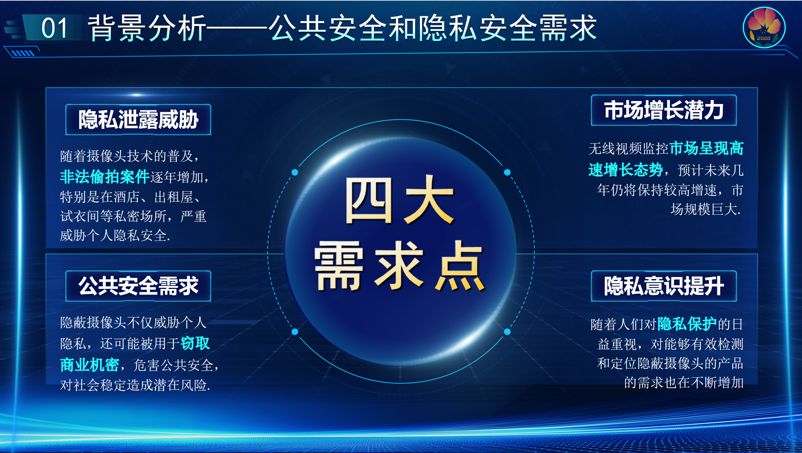
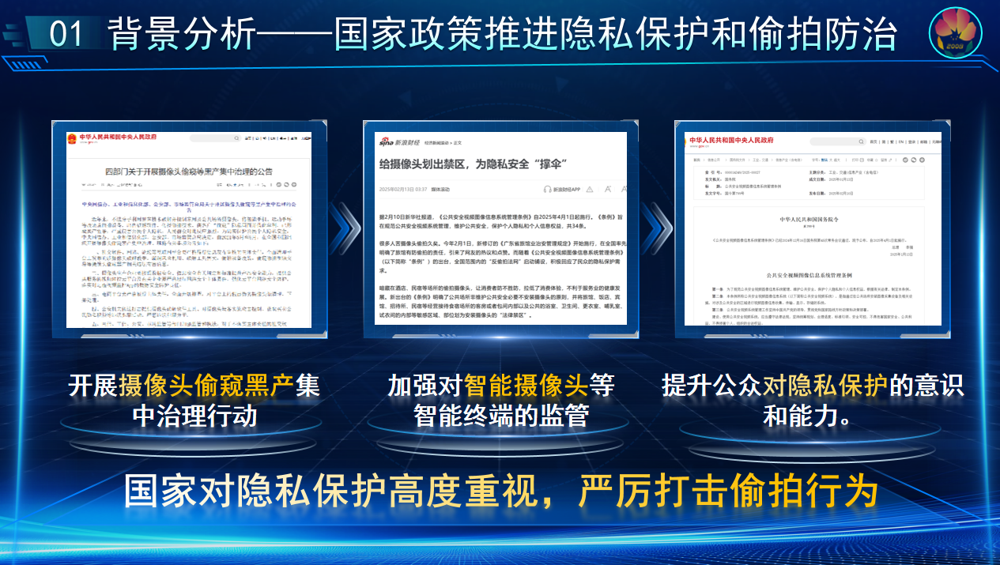
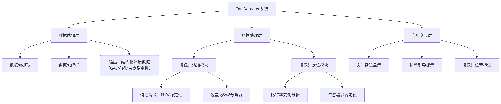
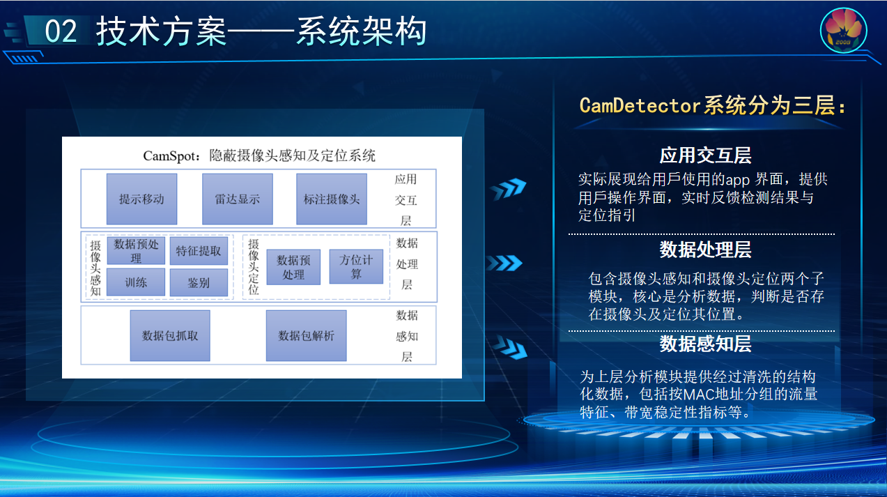
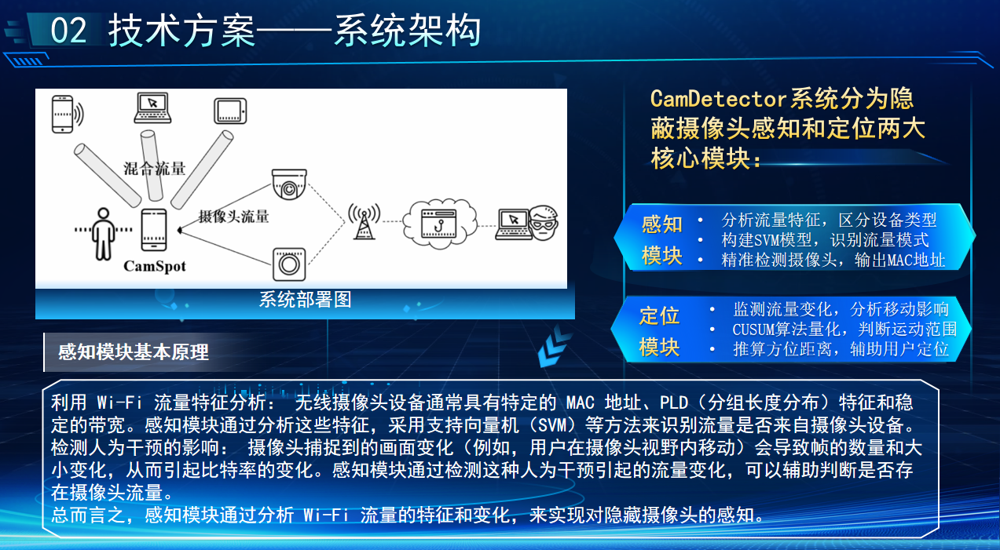
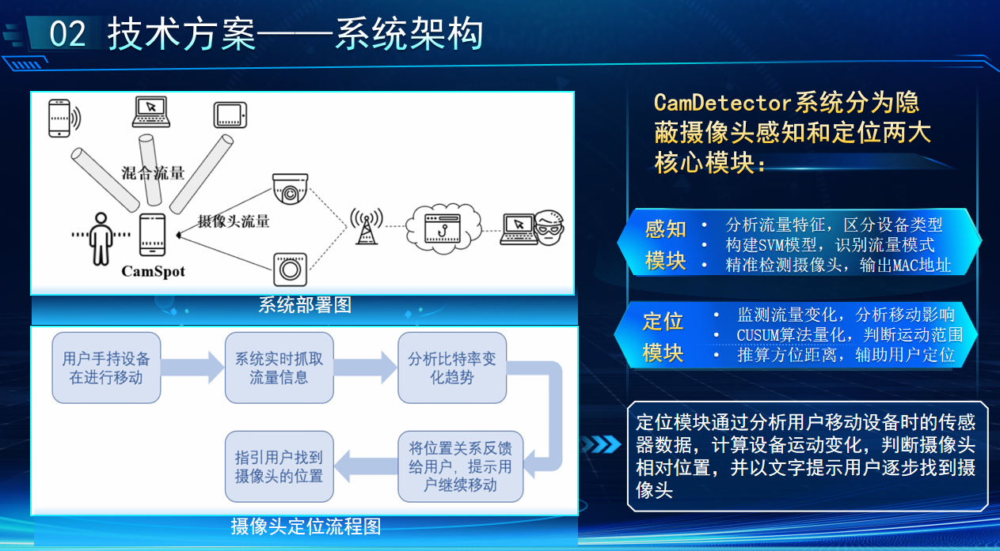
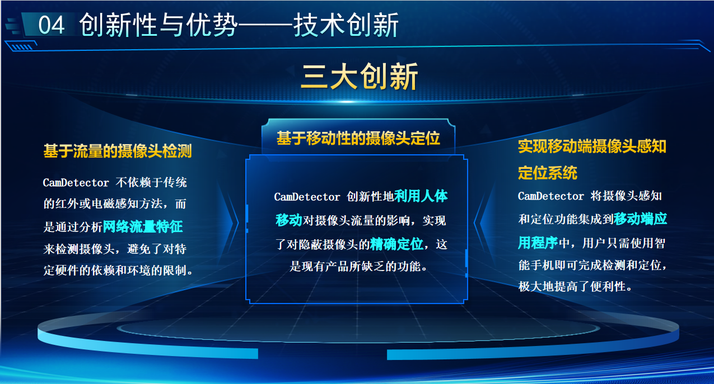
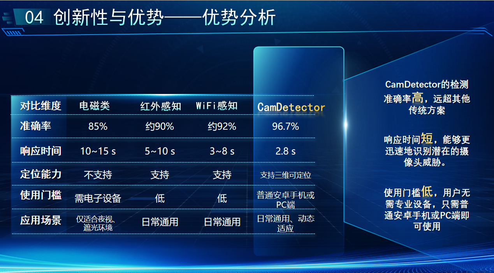

# CamDetector

## 项目立足方向
本作品聚焦于 智慧安防、智能社区、智能家居 等国家重点技术发展方向，紧贴“个人隐私保护”和“安全空间建设”两大核心诉求，应用于酒店民宿偷拍防范、办公区域泄密监测、公共空间隐私巡查等多类场景，致力于构建全民可用、无设备依赖、实时高效的智能摄像头感知防护体系。

## 项目背景
近年来，隐蔽摄像头滥用问题日益严峻：

• 偷拍事件频发，部分电商平台甚至公开售卖隐蔽摄像头；  
• 公众对隐私安全防范意识薄弱，仅21%的住客会主动检查房间；  
• 传统检测手段依赖硬件、误报率高、操作复杂，难以普及。  
与此同时，国家政策持续加码隐私安全立法：

•《民法典》正式将偷拍纳入侵权范畴；  
•个人信息保护法、生物识别安全规范等法规密集出台；  
•市场与法规共同推动智能隐私防护技术快速落地。  

## 当前难点与挑战
我们调研并归纳出目前隐蔽摄像头防护领域的四大核心痛点：
| 现有方式           | 技术局限                         | 用户痛点               |
|--------------------|----------------------------------|------------------------|
| 红外检测           | 需夜视环境、遮挡易失效           | 不适用于日常环境       |
| 电磁检测           | 家电干扰大、误报率高             | 使用门槛高             |
| Wi-Fi嗅探          | 无法区分设备类型                 | 检测结果不明确         |
| 摄像头反光检查     | 主观性强                         | 效率低，无法定位       |


此外：
•多设备并存的复杂无线环境下，现有方法准确性不足；  
•主流APP无法对摄像头进行有效追踪和精确定位；  
•用户缺乏使用门槛低、实时性强的解决方案。  

## 我们的解决方案：CamDetector
为应对上述问题，我们提出了创新性的解决方案——CamDetector：基于Wi-Fi流量分析的摄像头检测与定位系统：

### 一、系统架构


**三层架构详解**


#### 数据感知层
•核心技术：基于Libpcap+Aircrack-ng双引擎抓包，支持802.11协议解析五级过滤流水线（CRC校验/MAC白名单等）  
•输出：清洗后的结构化数据流  

#### 数据处理层
| 模块     | 技术实现                                                   | 性能指标              |
|----------|------------------------------------------------------------|-----------------------|
| 感知模块 | PLD特征分析（CDF量化）<br>带宽稳定性检测（滑动窗口算法） | 准确率96.7%<br>误报率<3% |
| 定位模块 | 比特率-距离模型：<br>`d = 0.0023 ΔB² + 0.15 ΔB + 1.2`<br>方向估计（SNR空间梯度） | 定位误差<br><0.5m @ 3m |

#### 应用交互层
•动态引导：通过三色雷达图实时显示威胁方位（红=视野内，黄=邻近，绿=安全）  
•语音提示："检测到右前方2.3米存在摄像头"（支持多语言切换）  

### 二、核心功能
#### 智能感知：
•无需解密内容，通过分析加密视频流的PLD分布特征和带宽稳定性，精准判断摄像头流量；  
•使用轻量化SVM分类器，对流量进行快速分类，准确率达96.7%。  


#### 精准定位：
•基于用户移动引发的比特率变化，推断其是否进入摄像头视野；  
•结合传感器数据（加速度+SNR）实现方向与距离联合估计；  
•在3米范围内定位误差小于0.48米，方向误差小于4.2°。  


#### 移动端无感部署：
•仅依赖智能手机本身，无需额外设备；  
•轻量部署，CPU占用<15%，3秒内完成检测反馈；  
•兼容86款主流摄像头，适用于家庭、商用、出行等多场景。  

## 产品创新性

### 基于流量的摄像头检测
•创新点：不依赖红外或电磁传感器，完全通过分析网络流量特征（如PLD特征、带宽稳定性等）来检测隐蔽摄像头。  
•优势：摆脱硬件依赖，能适应更多环境场景和设备类型。  
### 基于移动性的摄像头定位
•创新点：通过人体移动引发的比特率波动，判断摄像头的方向与距离，实现精确定位。  
•优势：为市面上现有产品所缺乏的功能，提升了实际可用性和可操作性。  
### 实现移动端一体化感知与定位
•创新点：将检测与定位功能集成到智能手机App中，用户无需额外设备。  
•优势：显著提升了使用便利性，具备良好的用户体验与部署推广能力。  

## 市场对比优势（竞品分析）


## 应用场景与社会价值
•酒店/民宿隐私检测：住客可自查房间，避免偷拍；  
•办公/会议室安全巡查：规避机密信息泄露；  
•学校/浴室/更衣室等重点区域防护：辅助管理者排查可疑设备；  
•助力政策监管与执法排查：技术可嵌入监管平台，提高执法效率。  

## 作品价值与展望
CamDetector 以轻量化、高准确率、强定位能力为核心优势，真正将隐私防护落地到个人终端，具备广泛的商业拓展前景和社会治理价值，填补了国内外在“加密摄像头检测”与“无设备定位”方面的技术空白，是智慧安防领域的一项重要技术突破。

## 如何运行我们的项目
这是一个使用 [`create-next-app`](https://nextjs.org/docs/app/api-reference/cli/create-next-app) 脚手架创建的 [Next.js](https://nextjs.org) 项目。

### 🚀 快速开始

首先，运行开发服务器：

```bash
npm run dev
# 或者
yarn dev
# 或者
pnpm dev
# 或者
bun dev
```

然后在浏览器中打开 [http://localhost:3000](http://localhost:3000) 查看效果。

你可以通过修改 `app/page.tsx` 文件来开始编辑页面。页面会在你修改后自动更新。

本项目使用 [`next/font`](https://nextjs.org/docs/app/building-your-application/optimizing/fonts) 自动优化并加载 [Geist 字体](https://vercel.com/font)，这是由 Vercel 推出的一款新字体。

### 📚 了解更多

想进一步了解 Next.js，可以查看以下资源：

- [Next.js 官方文档](https://nextjs.org/docs) - 了解 Next.js 的功能与 API。
- [Learn Next.js](https://nextjs.org/learn) - 一套交互式的 Next.js 教程。

你还可以查看 [Next.js 的 GitHub 仓库](https://github.com/vercel/next.js) —— 欢迎反馈和贡献！

### ☁️ 在 Vercel 上部署

部署 Next.js 应用最简单的方式是使用由 Next.js 团队创建的 [Vercel 平台](https://vercel.com/new?utm_medium=default-template&filter=next.js&utm_source=create-next-app&utm_campaign=create-next-app-readme)。

查看我们的 [Next.js 部署文档](https://nextjs.org/docs/app/building-your-application/deploying) 了解更多详情。


